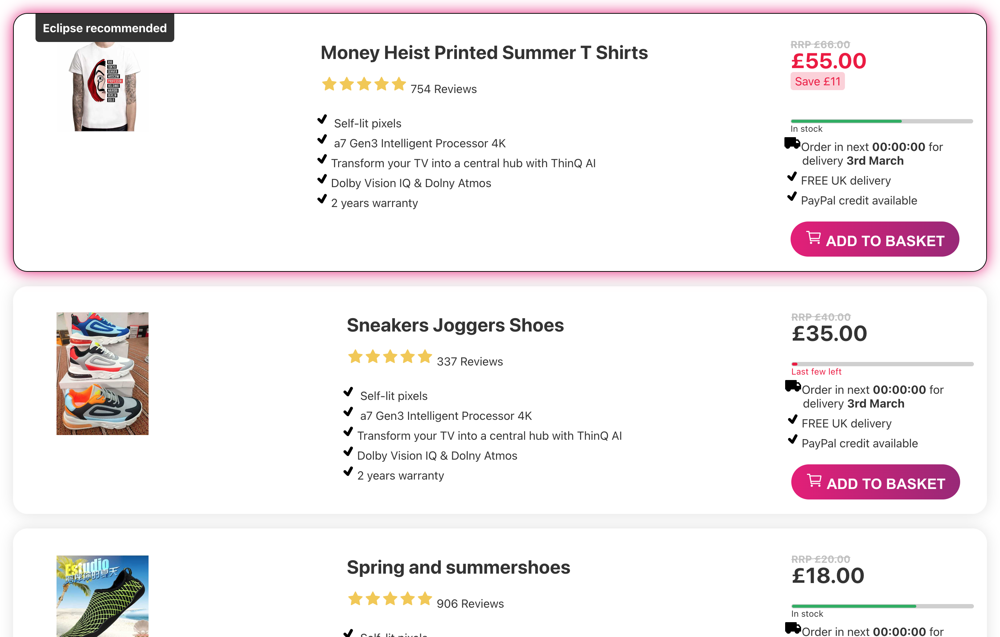
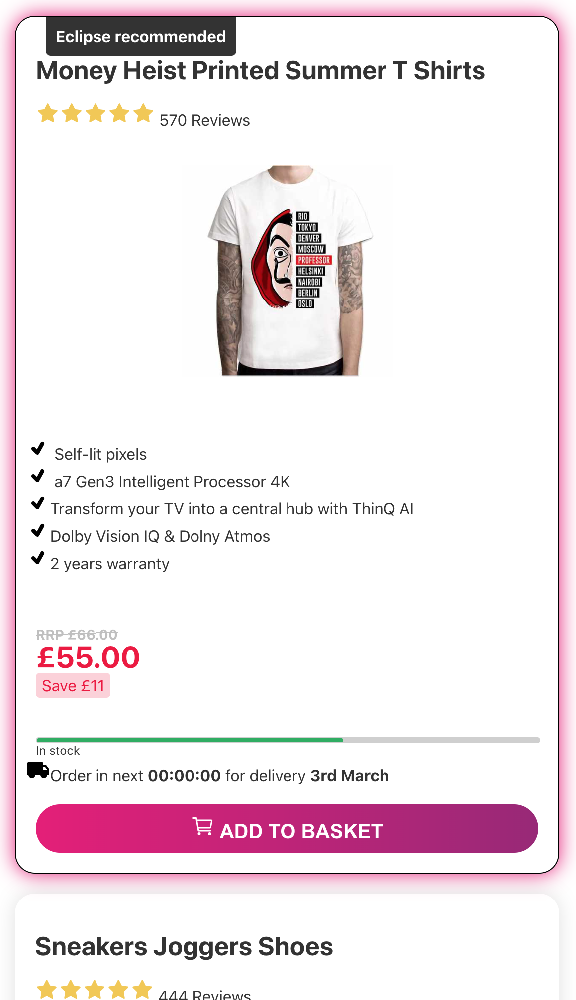

# ★ EclipseAPP ★ TEST 

## Stack
- JS
- SolidJS (first time used SolidJS)
- NodeJS
- ReactJS
- SCSS (pre- optional)
- IconPack
- RTL (not yet)

## Tested with

- Node.js (16.19.0)
- NPM (8.19.3)
- Chrome Version 118.0.5993.88  (Official Build) (x86_64)

## Overview

EclipseApp:

- After load list of items, Click any BUTTON to see console details (ID/PRICE)
- Mobile/Desktop Flex, styling/css need rebuild... etc.
- Due to current TechTest nature some components are more/less complex, for explain please chat with me.

- App should be like attached screenshots below.

## The Code

One directory:

- `ec-app` - APP

To get the project start, jump into the `ec-app` directory and run `npm install` or `npm i` followed by `npm run start`.

You should see the webapp on http://localhost:3000/
